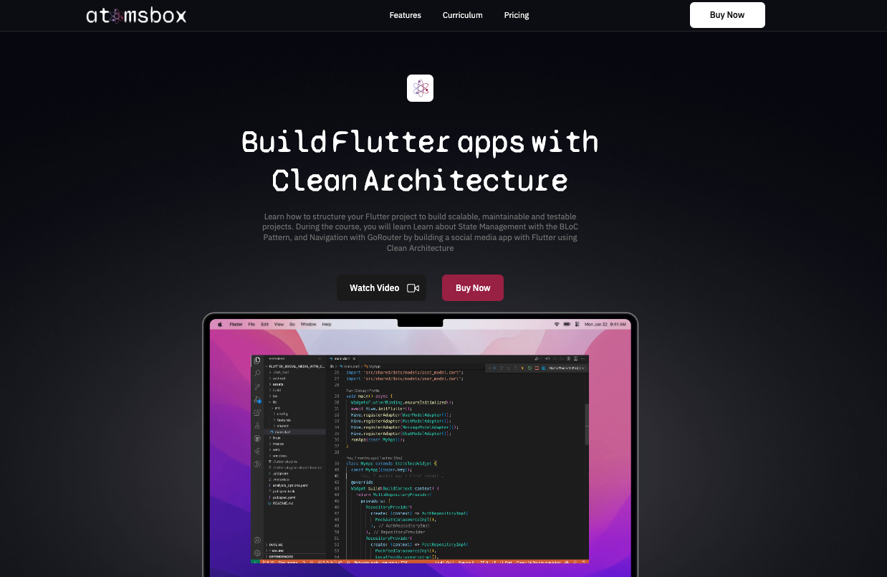

# Flutter Clean Architecture with Firebase

Welcome to the free preview of the comprehensive Flutter social media application project, built using the clean architecture design pattern and Firebase as its backend. This preview includes the implementation of the user authentication module.

This project demonstrates the use of advanced topics such as Clean Architecture, Firebase integration, Bloc pattern for state management, and Hive for local storage.

The full course expands further to include features like posting feeds, and a chat system.

[Get the Course](https://www.atomsbox.com/courses/flutter-with-clean-architecture)

## Structure

The application follows the principles of Clean Architecture and is structured into three primary layers:

- **Data Layer**: This layer includes the models, data sources (remote and local), and the repositories. It interacts with Firebase for remote data and Hive for local data.

- **Domain Layer**: This layer contains the core business logic (use cases) and entity definitions.

- **Presentation Layer**: This is where the UI-related logic resides. It uses Bloc for state management.

The application has three main features/modules:

- **Auth**: Deals with user authentication, both locally and remotely through Firebase.

- **Feed** (not included in the preview): Handles the creation, fetching, and management of user posts.

- **Chat** (not included in the preview): Manages real-time chat functionality between users.

All modules follow the above-mentioned architectural layers and are organized accordingly within their respective directories.

## Usage

- **User Authentication**: User can register, login and logout.

- **Feed Posting**: Users can view posts. Coming soon: add and delete posts. 

- **Chat**: Users can chat with other users in real-time.

Please note that the code is written in a way to be easily read, extended, and maintained. This is in line with the principles of Clean Architecture, which aims to separate concerns and make the codebase more understandable and flexible.

## Customization

Feel free to customize the code to suit your needs. The codebase is modular and flexible, making it easy to add, remove, or modify features.

## Dependencies

The application is built using various dependencies that aid in implementing its features:

- Firebase Core, Firestore, and Auth for backend operations.
- Hive for local database operations.
- Bloc for state management.
- Equatable, UUID, Built Value for data handling.
- Google Fonts and Flex Color Scheme for UI styling.
- Functional error handling with fpdart (not included in the preview)
- And several other for testing and mocking.

## Full Course
For the full feature set, including feed posting and real-time chat functionalities, consider purchasing the full course. The complete course will guide you in building a more extensive application, fostering a deeper understanding of Flutter, Firebase, and the principles of Clean Architecture.

[Get the Course](https://www.atomsbox.com/courses/flutter-with-clean-architecture)
